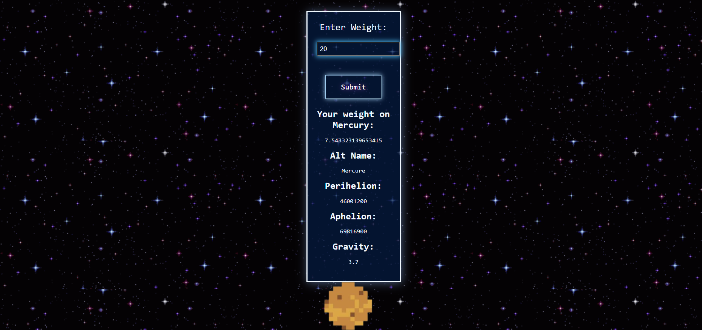

# Cosmic Weight Website
## This is a Django app that can display your weight and other data on any planet of your choosing.

### Description
**Overview:** 

This website allows the user to enter their weight, and then uses Solar System OpenData to retrieve various data about the planet
that is selected. Data includes aphelion, perihelion, name, and gravity.

**Technologies:** 

This project uses HTML, CSS, and JavaScript for the front-end and uses Django Ninja REST framework for the back-end. It uses Docker as well for publishing the website.

**Improvements:** 

This project can be built on further. We were originally going to create an orbital mapping of the planets with accurate positioning. Instead, the current presentation is in a vertical format.

### Instructions

## Django Server 

1. Make sure you are connected to the internet so this website runs properly.

2. Python must be installed in your machine.

3. Create an environment using `python -m venv venv`.

4. To activate the environment, 
    - `venv\Scripts\activate` for windows. 
    - `source venv/bin/activate` for linux.

5. Install the required packasges using `pip install -r requirements.txt`.

6. To run the server use `python manage.py runserver`.

## Docker container Deployment 

1. Make sure that docker is installed in your machine.

2. docker run siddharth9805/girlhack_ghcr:latest.

## Kubernative container deployment

1. Make sure that docker and minikube is installed in your machine.

2. kubectl apply -f deployment.yaml.

3. kubectl apply -f service.yaml.

4. minikube service <service-name> --url (service name is mensioned in the service.yml file).

5. Navigate to the browser mensioned in the terminal.

### Snippet of Project

### Credits

- https://api.le-systeme-solaire.net/en/

